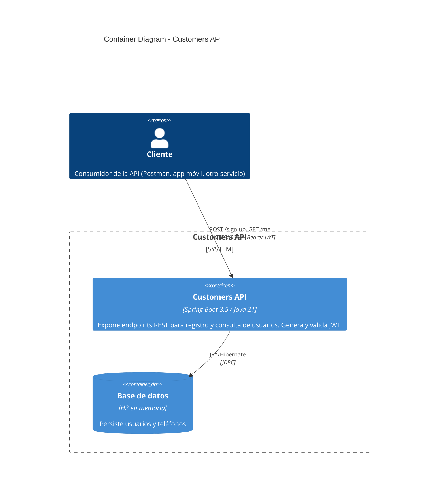
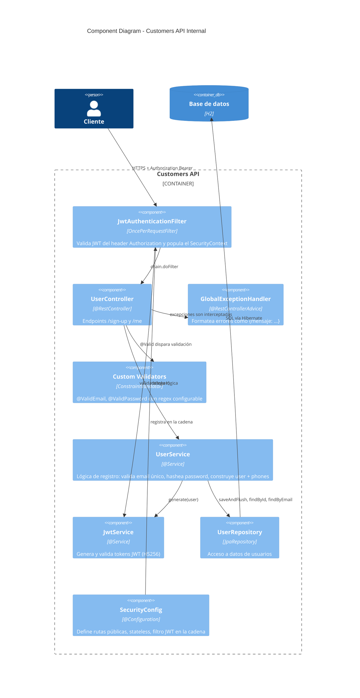
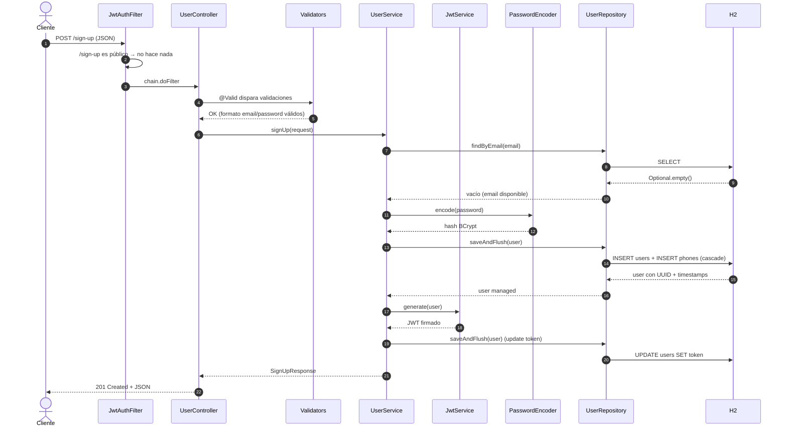
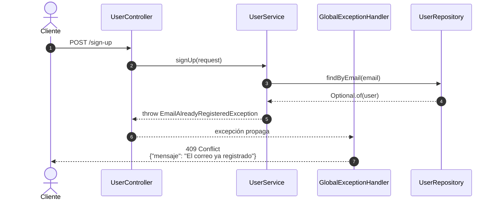
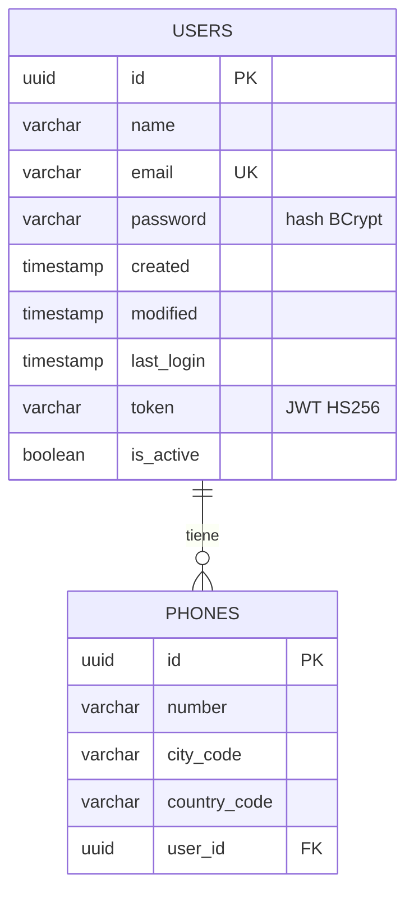

# Arquitectura — Customers API

Diagramas en Mermaid con sintaxis C4. GitHub los renderiza nativamente.

---

## 1. Container Diagram (C4 nivel 2)

Vista de alto nivel: qué contenedores componen la solución y cómo interactúan.

---

## 2. Component Diagram (C4 nivel 3)

Componentes internos del servicio Spring Boot.

---

## 3. Sequence Diagram — Flujo de `POST /sign-up`

### Flujo de error (email ya registrado)

---

## 4. ER Diagram — Modelo de datos

---

## Decisiones arquitectónicas

- **Capas claras**: controller / service / repository. El controller solo traduce HTTP; la lógica vive en el service; la persistencia en el repo.
- **Stateless**: no hay sesiones. Cada request se autentica por JWT. Escalable horizontalmente sin sticky sessions.
- **Seguridad por filtro**: el JWT se valida en `JwtAuthenticationFilter` antes de que la request llegue al controller. Patrón Chain of Responsibility de Spring Security.
- **Validación declarativa**: `@ValidEmail` y `@ValidPassword` encapsulan las reglas de negocio sobre formato. Regex configurable vía properties.
- **Manejo centralizado de errores**: `@RestControllerAdvice` garantiza que toda respuesta de error sigue el formato `{"mensaje": "..."}` exigido por BCI.
- **Inyección por constructor**: todos los beans usan final + constructor, facilitando tests sin Spring y dejando visibles las dependencias.
- **Transacciones atómicas**: `@Transactional` en el método de registro — o se crean user + phones juntos, o nada.
